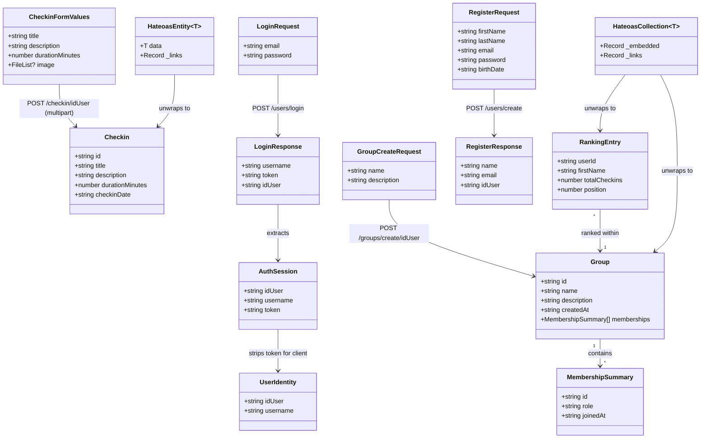

# Next.js SSR Frontend for StudyRats Platform

## Requirements

- Build a Next.js 14+ App Router frontend (SSR-first) that allows users to register, log in, perform daily study check-ins, list their participated groups, view their check-in history, and see per-group competitive rankings — consuming the existing Spring Boot HATEOAS backend (`http://localhost:9090`)
- Authenticate via the existing JWT Bearer token mechanism (RSA-signed) and persist auth state in httpOnly cookies to enable server-side rendering of protected pages without exposing the token to client-side JavaScript
- Resolve two backend prerequisites before frontend integration can succeed: (1) add explicit CORS configuration in `SecurityConfig` to allow `http://localhost:3000`, and (2) add a `GET /checkin/user/{idUser}` endpoint to support the check-in history listing screen — both are currently absent from the `studyrats` backend
- Containerize the frontend with Docker following the same multi-stage build pattern used by the backend; extend the existing `studyrats/docker-compose.yml` to add a `frontend` service on the shared `studyrats-network` so the full stack (MySQL + backend + frontend) starts with a single `docker-compose up --build`

---

## Entities



---

## Approach

1. **Frontend Architecture — Next.js App Router (SSR-first)**:
   - Use Next.js 14+ App Router with a `(auth)` route group for public pages (login, register) and a `(protected)` route group for authenticated pages (dashboard, checkin, checkins, ranking)
   - Data-fetching pages (dashboard, checkins, ranking) are async Server Components that read the JWT from httpOnly cookies server-side and call the backend directly — no client-side loading spinners for initial data
   - Interactive pages (login form, register form, checkin form) are Client Components (`'use client'`) because they require event handlers and controlled state
   - Route protection is enforced at the edge via `middleware.ts`, which checks for the presence of the `studyrats_session` cookie before any protected page renders; unauthenticated requests are redirected to `/login`

2. **Auth State Strategy — httpOnly Cookie + BFF + React Context**:
   - The browser never calls the Spring Boot backend directly for auth; it calls a Next.js API route (`/api/auth/login`) which proxies to `POST /users/login`, receives the JWT, and sets three cookies: `studyrats_session` (httpOnly — JWT, server-side only), `studyrats_token_pub` (non-httpOnly — JWT, read by client-side Axios interceptor), and `studyrats_user` (non-httpOnly — JSON of `{ idUser, username }`, read by AuthContext)
   - On logout, `/api/auth/logout` clears all three cookies and redirects to `/login`
   - The root server layout reads `studyrats_session` and `studyrats_user` server-side and hydrates `AuthContextProvider` with `UserIdentity`; client components access identity via `useAuth()` without any extra fetch

3. **API Client Layer — Axios + HATEOAS Normalization**:
   - A configured Axios instance (`lib/api/client.ts`) targets `NEXT_PUBLIC_API_BASE_URL` with `Accept: application/hal+json`; a client-side request interceptor reads `studyrats_token_pub` and attaches `Authorization: Bearer <token>` automatically
   - A HATEOAS utility (`lib/api/hateoas.ts`) provides `unwrapEntity<T>` (strips `_links`, returns `T`) and `unwrapCollection<T>` (extracts the first key of `_embedded` and returns `T[]`); no component ever reads `_embedded` or `_links` directly
   - Checkin creation is the only `multipart/form-data` endpoint; all other calls use `application/json`; this is isolated in `lib/api/checkin.ts` so the inconsistency is contained

4. **Docker Containerization — multi-stage build + shared network**:
   - Create `studyrats-frontend/Dockerfile` using the same multi-stage pattern as the backend: a `deps` stage installs `node_modules`, a `builder` stage runs `next build`, and a lean `runner` stage based on `node:18-alpine` serves the production build via `next start`
   - Extend `studyrats/docker-compose.yml` with a `frontend` service: `build: ../studyrats-frontend`, `ports: "3000:3000"`, `depends_on: app`, joined to `studyrats-network`
   - Inside Docker, the Next.js server communicates with the Spring Boot backend via the Docker internal hostname `studyrats-app:9090` — this requires a server-side-only env var `API_BASE_URL=http://studyrats-app:9090` distinct from `NEXT_PUBLIC_API_BASE_URL=http://localhost:9090` which the browser uses to reach the backend directly through the host-exposed port
   - API service functions called from Server Components and Next.js API routes MUST use `process.env.API_BASE_URL`; the client-side Axios instance MUST use `process.env.NEXT_PUBLIC_API_BASE_URL` — this dual-URL pattern resolves the Docker network boundary between server-side and browser contexts

5. **Backend Prerequisites (must be completed before frontend integration)**:
   - CORS fix: add a `CorsConfigurationSource` `@Bean` in `SecurityConfig.java` that allows `http://localhost:3000`, configures allowed methods and headers, and sets `allowCredentials(true)` — without this, every browser-originated request is blocked by the same-origin policy
   - New checkin listing endpoint: add `GET /checkin/user/{idUser}` backed by a Spring Data derived query; this is required for the `/checkins` page; if the endpoint is not yet deployed, the page falls back to an empty state rather than crashing

---

## Structure

### Inheritance Relationships
1. `AuthContextType` interface defines `user: UserIdentity | null` and `logout: () => void`
2. `AuthContextProvider` (Client Component) implements `AuthContextType` via `React.createContext`
3. All page components are either async Server Components (no base class) or Client Component `FC<Props>` — no custom base classes
4. API service modules in `lib/api/` are plain TypeScript modules exporting typed async functions — no class hierarchy

### Dependencies
1. `middleware.ts` depends only on `next/server` — no application code; reads cookies, returns redirect or next
2. `app/layout.tsx` (Server Component) depends on `lib/auth/session.ts` to read the session; passes `UserIdentity` to `AuthContextProvider`
3. `AuthContextProvider` depends on `next/navigation` (`useRouter`) for the logout redirect; exposes `useAuth()` hook
4. `app/(protected)/layout.tsx` (Server Component) depends on `lib/auth/session.ts`; calls `redirect('/login')` if session absent
5. All `app/(protected)/*/page.tsx` Server Components depend on `lib/auth/session.ts` (for token), relevant service in `lib/api/`, and their child UI components
6. `app/api/auth/login/route.ts` depends on `lib/api/auth.ts` (backend proxy) and `next/server` (cookie setting)
7. `lib/api/groups.ts` and `lib/api/checkin.ts` depend on `lib/api/client.ts` (Axios instance) and `lib/api/hateoas.ts` (response normalization)
8. `lib/api/auth.ts` uses a raw Axios call (no interceptor) since login and register do not need a token

### Layered Architecture
1. **Edge Layer** (`middleware.ts`): Route protection before any render; inspects `studyrats_session` cookie; zero business logic
2. **BFF API Route Layer** (`app/api/auth/*/route.ts`): Cookie lifecycle management; proxies auth calls to Spring Boot; sets/clears httpOnly cookies; the only layer that handles the full JWT token
3. **Page / Server Component Layer** (`app/(protected)/*/page.tsx`): SSR data fetching; reads auth cookie server-side; calls API lib functions with explicit token; passes typed props to UI components
4. **API Client Layer** (`lib/api/*.ts`): Typed, normalized wrappers over the Spring Boot backend; HATEOAS unwrapping; multipart construction for checkin; all error mapping; uses `API_BASE_URL` (server-side, Docker-internal hostname) or `NEXT_PUBLIC_API_BASE_URL` (client-side, browser-reachable hostname) based on execution context
5. **Component Layer** (`components/forms/`, `components/ui/`): Pure UI — forms with validation, display cards, tables; receive typed props; no direct API calls
6. **Context Layer** (`contexts/AuthContext.tsx`): Global client-side user identity; no token storage; drives conditional navigation and user display
7. **Infrastructure Layer** (`studyrats-frontend/Dockerfile`, `studyrats/docker-compose.yml`): Multi-stage container build and service orchestration; frontend container joins `studyrats-network` alongside `studyrats-app` and `studyrats-mysql`

---

## Operations

### Backend Change 1 — Fix CORS in SecurityConfig.java

**File**: `studyrats/src/main/java/com/example/studyrats/config/SecurityConfig.java`

1. Responsibility: Allow browser-originated cross-origin requests from the Next.js frontend to reach the Spring Boot API; without this, all AJAX calls are blocked by the browser before leaving the client
2. New bean — `corsConfigurationSource()`:
   - Add `@Value("${app.cors.allowed-origins:http://localhost:3000}") private String allowedOrigins;` field to the class
   - Add `@Bean public CorsConfigurationSource corsConfigurationSource()`:
     - Logic:
       - `CorsConfiguration config = new CorsConfiguration()`
       - `config.setAllowedOriginPatterns(List.of(allowedOrigins.split(",")))`
       - `config.setAllowedMethods(List.of("GET", "POST", "PUT", "DELETE", "OPTIONS"))`
       - `config.setAllowedHeaders(List.of("Authorization", "Content-Type", "Accept"))`
       - `config.setExposedHeaders(List.of("Authorization"))`
       - `config.setAllowCredentials(true)`
       - `config.setMaxAge(3600L)`
       - `UrlBasedCorsConfigurationSource source = new UrlBasedCorsConfigurationSource()`
       - `source.registerCorsConfiguration("/**", config)`
       - Return `source`
3. Update `securityFilterChain` method:
   - Change `.cors(cors -> cors.configure(http))` to `.cors(cors -> cors.configurationSource(corsConfigurationSource()))`
4. Annotations: `@Bean` on the new method
5. Add to `application.properties`: `app.cors.allowed-origins=http://localhost:3000`

---

### Backend Change 2a — Add Checkin Query to CheckinRepository.java

**File**: `studyrats/src/main/java/com/example/studyrats/repository/CheckinRepository.java`

1. Responsibility: Provide a query to retrieve all check-ins for a given user, ordered most recent first
2. New method:
   - `List<Checkin> findByUserUserIdOrderByCheckinDateDesc(String userId)`
   - Spring Data derives the SQL from the method name; no `@Query` annotation needed
   - Returns an empty list if the user has no check-ins

---

### Backend Change 2b — Add getCheckinsByUser to CheckinService.java

**File**: `studyrats/src/main/java/com/example/studyrats/service/CheckinService.java`

1. Responsibility: Service-layer method to fetch check-in history for a user
2. New method — `public List<Checkin> getCheckinsByUser(String userId)`:
   - Logic:
     - Return `checkinRepository.findByUserUserIdOrderByCheckinDateDesc(userId)`
     - If user has no check-ins, the repository returns an empty list — return it as-is
   - Constraints: Associations `user` and `group` are `FetchType.LAZY`; do not access them within this method to avoid N+1 queries; the response DTO only needs the flat checkin fields

---

### Backend Change 2c — Add GET /checkin/user/{idUser} to CheckinController.java

**File**: `studyrats/src/main/java/com/example/studyrats/controller/CheckinController.java`

1. Responsibility: Expose check-in history for a user via a RESTful GET endpoint with HATEOAS links
2. New method:
   - Annotation: `@GetMapping("/user/{idUser}")`
   - Signature: `public ResponseEntity<CollectionModel<EntityModel<Checkin>>> getCheckinsByUser(@PathVariable String idUser)`
   - Logic:
     - Call `checkinService.getCheckinsByUser(idUser)`
     - If the list is empty: return `ResponseEntity.ok().contentType(MediaTypes.HAL_JSON).body(CollectionModel.empty())`
     - Otherwise: map each `Checkin c` to `EntityModel.of(c, linkTo(CheckinController.class).slash("user").slash(idUser).withRel("self").withType("GET"))`
     - Return `ResponseEntity.status(HttpStatus.OK).contentType(MediaTypes.HAL_JSON).body(CollectionModel.of(entityList, linkTo(methodOn(CheckinController.class).getCheckinsByUser(idUser)).withRel("self").withType("GET")))`
   - No `@PreAuthorize` annotation; the global security config already requires auth for all non-public paths

---

### Frontend: Project Setup

1. Responsibility: Initialize the Next.js 14+ frontend project alongside the existing backend
2. Location: `/Users/eduardaalves/Desktop/ESPEC/roadmap/Rats/studyrats-frontend/`
3. Bootstrap command:
   - `npx create-next-app@latest studyrats-frontend --typescript --app --tailwind --eslint`
4. Additional dependencies:
   - `npm install axios js-cookie react-hook-form`
   - `npm install -D @types/js-cookie`
5. File `.env.local` at project root (local dev outside Docker — both vars point to the same host):
   - `NEXT_PUBLIC_API_BASE_URL=http://localhost:9090`
   - `API_BASE_URL=http://localhost:9090`
   - Note: inside Docker, `API_BASE_URL` is overridden at runtime by `docker-compose.yml` to `http://studyrats-app:9090`
6. Directory structure to create (beyond what create-next-app generates):
   ```
   app/
     (auth)/login/
     (auth)/register/
     (protected)/dashboard/
     (protected)/checkin/
     (protected)/checkins/
     (protected)/groups/[idGroup]/ranking/
     api/auth/login/
     api/auth/logout/
   lib/api/
   lib/auth/
   contexts/
   components/forms/
   components/ui/
   types/
   ```

---

### Create Type Definitions — types/index.ts

1. Responsibility: Single source of truth for all TypeScript interfaces; no implementation logic
2. Types to define:

```typescript
// Auth
export interface AuthSession {
  idUser: string;
  username: string;
  token: string;
}

export interface UserIdentity {
  idUser: string;
  username: string;
}

// Backend response shapes (after HATEOAS unwrapping)
export interface MembershipSummary {
  id: string;
  role: 'ADMIN' | 'MEMBER';
  joinedAt: string;
}

export interface Group {
  id: string;
  name: string;
  description: string;
  createdAt: string;
  memberships: MembershipSummary[];
}

export interface Checkin {
  id: string;
  title: string;
  description: string;
  durationMinutes: number;
  checkinDate: string;
}

export interface RankingEntry {
  userId: string;
  firstName: string;
  totalCheckins: number;
  position: number; // added by frontend; not returned by backend
}

// Request shapes
export interface LoginRequest { email: string; password: string }
export interface LoginResponse { username: string; token: string; idUser: string }
export interface RegisterRequest { firstName: string; lastName: string; email: string; password: string; birthDate: string }
export interface RegisterResponse { name: string; email: string; idUser: string }
export interface CheckinFormValues { title: string; description: string; durationMinutes: number; image?: FileList }
export interface GroupCreateRequest { name: string; description: string }

// HATEOAS wrappers
export interface HateoasEntity<T> extends Record<string, unknown> { _links?: Record<string, { href: string }> }
export interface HateoasCollection<T> {
  _embedded?: Record<string, (T & { _links?: unknown })[]>;
  _links?: Record<string, { href: string }>;
}
```

---

### Create HATEOAS Parser — lib/api/hateoas.ts

1. Responsibility: Normalize all HAL+JSON responses into plain objects before use in components or service functions; the rest of the application never accesses `_embedded` or `_links`
2. Methods:
   - `unwrapEntity<T>(response: HateoasEntity<T>): T`:
     - Logic: `const { _links, ...data } = response as any; return data as T`
   - `unwrapCollection<T>(response: HateoasCollection<T>): T[]`:
     - Logic:
       - If `!response._embedded`: return `[]`
       - `const key = Object.keys(response._embedded)[0]`
       - `const items = response._embedded[key]`
       - Return `items.map(item => { const { _links, ...data } = item as any; return data as T })`
   - `addPosition(entries: Omit<RankingEntry, 'position'>[]): RankingEntry[]`:
     - Logic: `return entries.map((e, i) => ({ ...e, position: i + 1 }))`

---

### Create Axios API Client — lib/api/client.ts

1. Responsibility: Configured Axios instance shared by all API service modules; handles base URL, default headers, and client-side auth injection
2. Configuration:
   - `baseURL: process.env.NEXT_PUBLIC_API_BASE_URL ?? 'http://localhost:9090'`
   - Default header `Accept: 'application/hal+json'`
3. Request interceptor (guarded: `typeof window !== 'undefined'`):
   - Import `Cookies` from `js-cookie`
   - Read `Cookies.get('studyrats_token_pub')`
   - If present: `config.headers['Authorization'] = 'Bearer ' + token`
   - Return `config`
4. Response interceptor:
   - On response error with `error.response?.status === 401`:
     - If `typeof window !== 'undefined'`: `window.location.href = '/login'`
   - Re-throw all errors so callers can handle them

---

### Create Auth API Service — lib/api/auth.ts

1. Responsibility: Typed wrappers for the two public backend auth endpoints; used by Next.js API routes (server-side) using a separate plain axios instance without the interceptor
2. Import: `import axios from 'axios'` (fresh instance, not the shared client)
3. Base URL: `process.env.NEXT_PUBLIC_API_BASE_URL ?? 'http://localhost:9090'`
4. Methods:
   - `loginBackend(request: LoginRequest): Promise<LoginResponse>`:
     - Logic:
       - `const res = await axios.post('/users/login', request, { baseURL, headers: { 'Content-Type': 'application/json', 'Accept': 'application/hal+json' } })`
       - Return `unwrapEntity<LoginResponse>(res.data)`
   - `registerBackend(request: RegisterRequest): Promise<RegisterResponse>`:
     - Logic:
       - `const res = await axios.post('/users/create', request, { baseURL, headers: { 'Content-Type': 'application/json' } })`
       - Return `unwrapEntity<RegisterResponse>(res.data)`
       - Catch AxiosError with `status === 409`: re-throw as `new Error('EMAIL_ALREADY_EXISTS')`

---

### Create Groups API Service — lib/api/groups.ts

1. Responsibility: Typed wrappers for all group-related backend endpoints; all methods accept `token` explicitly for server-component compatibility
2. All methods use the shared `apiClient` from `lib/api/client.ts` with an explicit `Authorization` header
3. Methods:
   - `getGroupsByUser(idUser: string, token: string): Promise<Group[]>`:
     - `GET /groups/user/${idUser}` → `unwrapCollection<Group>(res.data)`
   - `getGroupById(idUser: string, idGroup: string, token: string): Promise<Group>`:
     - `GET /groups/${idUser}/${idGroup}` → `unwrapEntity<Group>(res.data)`
   - `createGroup(idUser: string, request: GroupCreateRequest, token: string): Promise<Group>`:
     - `POST /groups/create/${idUser}` with JSON body → `unwrapEntity<Group>(res.data)`
   - `joinGroup(idUser: string, idGroup: string, token: string): Promise<Group>`:
     - `POST /groupmember/join/${idUser}/${idGroup}` → `unwrapEntity<Group>(res.data.content ?? res.data)`
     - Catch AxiosError `status === 409`: re-throw as `new Error('ALREADY_MEMBER')`
   - `getRanking(idGroup: string, token: string): Promise<RankingEntry[]>`:
     - `GET /groups/ranking/${idGroup}` → `unwrapCollection<RankingEntry>(res.data)` → `addPosition(entries)`
   - All methods set `headers: { Authorization: 'Bearer ' + token }`

---

### Create Checkin API Service — lib/api/checkin.ts

1. Responsibility: Typed wrappers for checkin endpoints; `createCheckin` uses `multipart/form-data` (the only such endpoint in the entire API)
2. Methods:
   - `createCheckin(idUser: string, values: CheckinFormValues, token: string): Promise<Checkin[]>`:
     - Logic:
       - `const form = new FormData()`
       - `form.append('title', values.title)`
       - `form.append('description', values.description)`
       - `form.append('durationMinutes', String(Math.floor(values.durationMinutes)))`
       - If `values.image && values.image.length > 0`: `form.append('image', values.image[0])`
       - `POST /checkin/${idUser}` with `Content-Type: multipart/form-data` and `Authorization: Bearer ${token}`
       - Return `unwrapCollection<Checkin>(res.data)`
       - On HTTP 400: return `[]` (service returned empty due to already checked in or no groups)
   - `getCheckinsByUser(idUser: string, token: string): Promise<Checkin[]>`:
     - `GET /checkin/user/${idUser}` with Authorization header
     - Return `unwrapCollection<Checkin>(res.data)`

---

### Create Session Utility — lib/auth/session.ts

1. Responsibility: Server-side session extraction from Next.js request cookies (for Server Components and API Routes)
2. Note: This module uses `next/headers` which is server-only; never import in Client Components
3. Method — `getServerSession(): Promise<AuthSession | null>`:
   - Logic:
     - `const cookieStore = await cookies()` (from `next/headers`)
     - `const token = cookieStore.get('studyrats_session')?.value`
     - `const userRaw = cookieStore.get('studyrats_user')?.value`
     - If either is missing: return `null`
     - Try `const { idUser, username } = JSON.parse(userRaw)`
     - Return `{ idUser, username, token }`
     - Catch any error: return `null`

---

### Create Next.js API Route — app/api/auth/login/route.ts

1. Responsibility: BFF login handler — proxies to backend, sets three cookies, returns safe identity to browser
2. Method: exported `async function POST(request: Request)`
3. Logic:
   - Parse `await request.json()` as `LoginRequest`
   - Validate: if `!email || !password` return `NextResponse.json({ error: 'Campos obrigatórios' }, { status: 400 })`
   - Call `loginBackend({ email, password })` from `lib/api/auth.ts`
   - On success:
     - Build `NextResponse.json({ idUser, username }, { status: 200 })`
     - Call `.cookies.set('studyrats_session', token, { httpOnly: true, secure: process.env.NODE_ENV === 'production', sameSite: 'strict', path: '/', maxAge: 86400 })`
     - Call `.cookies.set('studyrats_token_pub', token, { httpOnly: false, sameSite: 'strict', path: '/', maxAge: 86400 })`
     - Call `.cookies.set('studyrats_user', JSON.stringify({ idUser, username }), { httpOnly: false, sameSite: 'strict', path: '/', maxAge: 86400 })`
     - Return the response
   - On AxiosError with status 401/403: return `NextResponse.json({ error: 'Email ou senha inválidos' }, { status: 401 })`
   - On other errors: return `NextResponse.json({ error: 'Erro interno' }, { status: 500 })`

---

### Create Next.js API Route — app/api/auth/logout/route.ts

1. Responsibility: Clear all auth cookies and signal the client to redirect to login
2. Method: exported `async function POST()`
3. Logic:
   - Build `NextResponse.json({ ok: true }, { status: 200 })`
   - Call `.cookies.set('studyrats_session', '', { httpOnly: true, sameSite: 'strict', path: '/', maxAge: 0 })`
   - Call `.cookies.set('studyrats_token_pub', '', { sameSite: 'strict', path: '/', maxAge: 0 })`
   - Call `.cookies.set('studyrats_user', '', { sameSite: 'strict', path: '/', maxAge: 0 })`
   - Return the response

---

### Create Middleware — middleware.ts (project root)

1. Responsibility: Edge-layer route protection; runs before any page server render
2. Logic:
   - Define `protectedPaths = ['/dashboard', '/checkin', '/checkins', '/groups']`
   - If `request.nextUrl.pathname` starts with any protected path:
     - Check `request.cookies.get('studyrats_session')?.value`
     - If missing or empty: `return NextResponse.redirect(new URL('/login', request.url))`
   - Return `NextResponse.next()`
3. Export `config`:
   ```typescript
   export const config = {
     matcher: ['/((?!_next/static|_next/image|favicon.ico|api/).*)'],
   }
   ```

---

### Create AuthContext — contexts/AuthContext.tsx

1. Responsibility: Client-side access to user identity (`idUser`, `username`) and `logout` function; no JWT token stored
2. Directive: `'use client'`
3. Context value type: `{ user: UserIdentity | null; logout: () => Promise<void> }`
4. Props: `AuthContextProvider` accepts `initialUser: UserIdentity | null`
5. State: `const [user, setUser] = useState<UserIdentity | null>(initialUser)`
6. `logout` function:
   - Call `await fetch('/api/auth/logout', { method: 'POST' })`
   - Call `setUser(null)`
   - Call `router.push('/login')` via `useRouter` from `next/navigation`
7. Export `useAuth()` hook: `return useContext(AuthContext)` — throw if used outside provider
8. Export `AuthContextProvider` component wrapping `AuthContext.Provider`

---

### Create Root Layout — app/layout.tsx

1. Responsibility: Wrap the entire application in `AuthContextProvider` with server-side hydration of initial user identity
2. Type: async Server Component
3. Logic:
   - Call `const session = await getServerSession()` from `lib/auth/session.ts`
   - Extract `initialUser = session ? { idUser: session.idUser, username: session.username } : null`
   - Render:
     ```tsx
     <html lang="pt-BR">
       <body>
         <AuthContextProvider initialUser={initialUser}>
           {children}
         </AuthContextProvider>
       </body>
     </html>
     ```

---

### Create Protected Route Layout — app/(protected)/layout.tsx

1. Responsibility: Secondary server-side auth guard for all protected pages; defense in depth alongside middleware
2. Type: async Server Component
3. Logic:
   - Call `const session = await getServerSession()`
   - If `null`: call `redirect('/login')` from `next/navigation`
   - Return `<>{children}</>`

---

### Create Login Page — app/(auth)/login/page.tsx

1. Responsibility: Public login page; redirects already-authenticated users to dashboard
2. Type: async Server Component
3. Logic:
   - Call `const session = await getServerSession()`
   - If session is not null: call `redirect('/dashboard')`
   - Return `<LoginForm />`

---

### Create LoginForm Component — components/forms/LoginForm.tsx

1. Responsibility: Controlled email/password login form with validation and error display
2. Directive: `'use client'`
3. Form fields (via `react-hook-form`):
   - `email`: type="email", required, label "Email"
   - `password`: type="password", required, label "Senha"
4. On submit:
   - `POST /api/auth/login` with `{ email, password }`
   - On 200: `router.push('/dashboard')`
   - On 401: `setError('Email ou senha inválidos')`
   - On network failure: `setError('Erro de conexão. Tente novamente.')`
5. Includes link `href="/register"` — "Não tem conta? Cadastre-se"

---

### Create Register Page — app/(auth)/register/page.tsx

1. Responsibility: Public registration page
2. Type: Server Component
3. Logic: if session exists, `redirect('/dashboard')`; else render `<RegisterForm />`

---

### Create RegisterForm Component — components/forms/RegisterForm.tsx

1. Responsibility: Full registration form with client-side validation mirroring backend constraints
2. Directive: `'use client'`
3. Form fields (via `react-hook-form`):
   - `firstName`: required, label "Nome"
   - `lastName`: required, label "Sobrenome"
   - `email`: type="email", required, label "Email"
   - `password`: type="password", required, minLength 6, label "Senha"
   - `birthDate`: type="date", required, validate `value < today` (mirrors `@Past`), label "Data de Nascimento"
4. On submit:
   - Call `fetch('/api/auth/register', { method: 'POST', body: JSON.stringify(values) })` — **Note**: requires creating `/api/auth/register/route.ts` which proxies to `registerBackend`
   - On 201: `router.push('/login?registered=true')`
   - On 409: `setError('Este email já está cadastrado')`
5. Includes link `href="/login"` — "Já tem conta? Entre"

---

### Create Register API Route — app/api/auth/register/route.ts

1. Responsibility: Proxy new user registration to backend; does not set auth cookies (backend returns no JWT on register)
2. Method: exported `async function POST(request: Request)`
3. Logic:
   - Parse body as `RegisterRequest`
   - Validate all fields present
   - Call `registerBackend(request)` from `lib/api/auth.ts`
   - On success: return `NextResponse.json(result, { status: 201 })`
   - On `ERROR 'EMAIL_ALREADY_EXISTS'`: return `NextResponse.json({ error: 'EMAIL_ALREADY_EXISTS' }, { status: 409 })`

---

### Create Dashboard Page — app/(protected)/dashboard/page.tsx

1. Responsibility: SSR listing of all groups the authenticated user participates in
2. Type: async Server Component
3. Logic:
   - `const session = await getServerSession()` — session is guaranteed by protected layout
   - `const groups = await getGroupsByUser(session!.idUser, session!.token)` from `lib/api/groups.ts`
   - If `groups.length === 0`: render empty state — "Você ainda não pertence a nenhum grupo."
   - Otherwise: render `<ul>` of `<GroupCard group={g} idUser={session!.idUser} />` for each group
   - Include a "Criar Grupo" button linking to `/groups/create` and a "Entrar em Grupo" button linking to `/groups/join`

---

### Create GroupCard Component — components/ui/GroupCard.tsx

1. Responsibility: Display a single study group with key info and navigation link to ranking
2. Type: Server Component (pure display)
3. Props: `group: Group`, `idUser: string`
4. Renders:
   - Group name (h3)
   - Description (p, truncated to 100 chars if longer)
   - Member count: `${group.memberships.length} membros`
   - Created at: formatted as `dd/MM/yyyy` using `Intl.DateTimeFormat('pt-BR')`
   - Link `href="/groups/${group.id}/ranking"` — "Ver Ranking"

---

### Create Checkin Page — app/(protected)/checkin/page.tsx

1. Responsibility: SSR wrapper for the check-in form; passes session data to client component
2. Type: async Server Component
3. Logic:
   - `const session = await getServerSession()`
   - Render `<CheckinForm idUser={session!.idUser} token={session!.token} />`

---

### Create CheckinForm Component — components/forms/CheckinForm.tsx

1. Responsibility: Interactive daily check-in form; sends multipart/form-data; interprets empty response correctly
2. Directive: `'use client'`
3. Props: `idUser: string`, `token: string`
4. State: `status: 'idle' | 'success' | 'alreadyDone' | 'noGroups' | 'error'`
5. Form fields (via `react-hook-form`):
   - `title`: required, label "Título"
   - `description`: required, label "Descrição"
   - `durationMinutes`: type="number", min=1, required, label "Duração (minutos)"
   - `image`: type="file", accept="image/*", optional, label "Imagem (opcional)"
6. On file change: validate `file.size <= 5 * 1024 * 1024`; if not, set field error "Imagem muito grande (máx 5MB)"
7. On submit:
   - Call `createCheckin(idUser, values, token)` from `lib/api/checkin.ts`
   - If returned array has length > 0: `setStatus('success')` — display "Check-in registrado em X grupos!"
   - If returned array is empty: `setStatus('alreadyDone')` — display "Você já fez check-in em todos os seus grupos hoje, ou não pertence a nenhum grupo."
   - On network/other error: `setStatus('error')` — display "Erro ao registrar check-in. Tente novamente."
8. Include note: "Seu check-in será registrado em todos os grupos que você participa."

---

### Create Checkins History Page — app/(protected)/checkins/page.tsx

1. Responsibility: SSR listing of the authenticated user's check-in history in reverse chronological order
2. Type: async Server Component
3. Logic:
   - `const session = await getServerSession()`
   - Call `getCheckinsByUser(session!.idUser, session!.token)` wrapped in try-catch
   - On success: if empty, render "Nenhum check-in registrado ainda."; otherwise render list of `<CheckinCard checkin={c} />` for each
   - On error (endpoint not yet deployed — 404): render "Histórico de check-ins em breve." (graceful degradation)

---

### Create CheckinCard Component — components/ui/CheckinCard.tsx

1. Responsibility: Display a single check-in entry
2. Type: Server Component
3. Props: `checkin: Checkin`
4. Renders:
   - Title (h4)
   - Description (p)
   - Duration: `${checkin.durationMinutes} min`
   - Date: `checkin.checkinDate` formatted as `dd/MM/yyyy HH:mm` using `Intl.DateTimeFormat('pt-BR', { dateStyle: 'short', timeStyle: 'short' })`

---

### Create Ranking Page — app/(protected)/groups/[idGroup]/ranking/page.tsx

1. Responsibility: SSR ranking page for a specific group, showing all members ordered by check-in count
2. Type: async Server Component
3. Params: `{ idGroup: string }` from `PageProps`
4. Logic:
   - `const session = await getServerSession()`
   - Use `Promise.all` to fetch in parallel:
     - `getRanking(idGroup, session!.token)` from `lib/api/groups.ts`
     - `getGroupById(session!.idUser, idGroup, session!.token)` from `lib/api/groups.ts`
   - Render group name as page heading
   - Pass `ranking` and `currentUserId = session!.idUser` to `<RankingTable entries={ranking} currentUserId={currentUserId} />`
   - If `ranking.length === 0`: render "Nenhum check-in registrado neste grupo ainda."

---

### Create RankingTable Component — components/ui/RankingTable.tsx

1. Responsibility: Display the sorted ranking list highlighting the current user's row
2. Type: Client Component (for row highlight logic) or Server Component with CSS class
3. Props: `entries: RankingEntry[]`, `currentUserId: string`
4. Renders a table with columns: `#` (position), `Nome` (firstName), `Check-ins` (totalCheckins)
5. Row for the current user (`entry.userId === currentUserId`) receives a distinct highlight class (e.g., `font-bold bg-yellow-50`)
6. Entries are displayed in received order (backend already orders by `totalCheckins DESC`; do NOT re-sort)

---

### Create Group Create Page — app/(protected)/groups/create/page.tsx

1. Responsibility: Page with form to create a new study group
2. Type: async Server Component wrapping `<GroupCreateForm idUser={session!.idUser} token={session!.token} />`

---

### Create GroupCreateForm Component — components/forms/GroupCreateForm.tsx

1. Responsibility: Form to create a new group; redirects to dashboard on success
2. Directive: `'use client'`
3. Props: `idUser: string`, `token: string`
4. Form fields: `name` (required, minLength 3, maxLength 100), `description` (optional)
5. On submit: call `createGroup(idUser, { name, description }, token)` → on success `router.push('/dashboard')`

---

### Create Group Join Page — app/(protected)/groups/join/page.tsx

1. Responsibility: Form to join an existing group by entering the group UUID
2. Type: async Server Component wrapping `<GroupJoinForm idUser={session!.idUser} token={session!.token} />`

---

### Create GroupJoinForm Component — components/forms/GroupJoinForm.tsx

1. Responsibility: Form to join a group by ID; surfaces ALREADY_MEMBER error
2. Directive: `'use client'`
3. Props: `idUser: string`, `token: string`
4. Form fields: `groupId` (required, label "ID do Grupo")
5. On submit: call `joinGroup(idUser, groupId, token)`
   - On success: `router.push('/dashboard')`
   - On `ALREADY_MEMBER` error: display "Você já é membro deste grupo"
   - On other errors: display "Grupo não encontrado ou erro ao entrar"

---

### Create Frontend Dockerfile — studyrats-frontend/Dockerfile

1. Responsibility: Multi-stage Docker image for the Next.js production build, mirroring the backend's two-stage pattern (build → run) with a lean Alpine base image for the final stage
2. Stages:

```dockerfile
# Stage 1 — Install dependencies
FROM node:18-alpine AS deps
WORKDIR /app
COPY package.json package-lock.json* ./
RUN npm ci --omit=dev

# Stage 2 — Build the application
FROM node:18-alpine AS builder
WORKDIR /app
COPY --from=deps /app/node_modules ./node_modules
COPY . .
# NEXT_PUBLIC_* vars must be present at build time for client-side bundles
ARG NEXT_PUBLIC_API_BASE_URL=http://localhost:9090
ENV NEXT_PUBLIC_API_BASE_URL=$NEXT_PUBLIC_API_BASE_URL
RUN npm run build

# Stage 3 — Production runner
FROM node:18-alpine AS runner
WORKDIR /app
ENV NODE_ENV=production
# Copy only what is needed to run
COPY --from=builder /app/public ./public
COPY --from=builder /app/.next/standalone ./
COPY --from=builder /app/.next/static ./.next/static
EXPOSE 3000
ENV PORT=3000
CMD ["node", "server.js"]
```

3. Requires `output: 'standalone'` in `next.config.ts` (see next operation) for the standalone server.js copy to work
4. `NEXT_PUBLIC_API_BASE_URL` is baked in at build time via `ARG`; it defaults to `http://localhost:9090` so the image works for local development without build args

---

### Update next.config.ts — enable standalone output

1. File: `studyrats-frontend/next.config.ts`
2. Responsibility: Enable Next.js standalone output mode so the Dockerfile Stage 3 can copy only `server.js` and required files instead of all of `node_modules`
3. Change:
   - Add `output: 'standalone'` to the `NextConfig` object
   - The final `next.config.ts` should export:
     ```typescript
     const nextConfig: NextConfig = {
       output: 'standalone',
     }
     export default nextConfig
     ```

---

### Update docker-compose.yml — add frontend service

1. File: `studyrats/docker-compose.yml`
2. Responsibility: Extend the existing compose file to add the `frontend` service so `docker-compose up --build` from the `studyrats/` directory starts MySQL + backend + frontend as a unified stack
3. Add the following service block under `services:`, after the existing `app:` block:

```yaml
  frontend:
    build:
      context: ../studyrats-frontend
      args:
        # NEXT_PUBLIC_API_BASE_URL is baked into the client bundle at build time;
        # the browser reaches the backend through the host-exposed port 9090
        NEXT_PUBLIC_API_BASE_URL: http://localhost:9090
    container_name: studyrats-frontend
    ports:
      - "3000:3000"
    environment:
      # Server-side URL: resolves to the backend container within the Docker network
      API_BASE_URL: http://studyrats-app:9090
      NODE_ENV: production
    depends_on:
      - app
    networks:
      - studyrats-network
```

4. Constraints:
   - `API_BASE_URL` (server-side, runtime env var) is injected via `environment:` — it points to `studyrats-app:9090` which is only reachable inside the Docker network
   - `NEXT_PUBLIC_API_BASE_URL` (client-side, build-time) is passed via `build.args:` — it must be `http://localhost:9090` so the browser can reach the backend through the host port mapping

---

### Update lib/api/client.ts — dual-URL strategy for Docker

1. Responsibility: Differentiate the backend base URL depending on whether the call originates from the Next.js server (inside Docker, use `API_BASE_URL`) or from the browser (outside Docker, use `NEXT_PUBLIC_API_BASE_URL`); without this, server-side calls inside Docker fail because `localhost:9090` does not resolve to the backend container
2. Updated `baseURL` logic:
   - `const baseURL = typeof window === 'undefined' ? (process.env.API_BASE_URL ?? 'http://localhost:9090') : (process.env.NEXT_PUBLIC_API_BASE_URL ?? 'http://localhost:9090')`
   - `typeof window === 'undefined'` is `true` in Node.js (server components, API routes) and `false` in the browser
3. Apply the same dual-URL logic in `lib/api/auth.ts` where a raw Axios instance is created (not using the shared client)
4. No other changes to the Axios configuration — interceptors, headers, and error handling remain unchanged

---

## Norms

1. **TypeScript**: `strict: true` in `tsconfig.json`; no `any` types; use `unknown` when input type is genuinely not known; all function parameters and return types explicitly typed
2. **Server vs. Client Components**: Default to Server Components; use `'use client'` only when the component requires: event handlers, `useState`, `useEffect`, browser-only APIs, or `useRouter`; never import server-only modules (e.g., `next/headers`) in Client Components
3. **HATEOAS**: All backend responses pass through `unwrapEntity` or `unwrapCollection` before use; no component, page, or service function reads `_embedded` or `_links` directly
4. **Token handling**: JWT is stored only in httpOnly cookie (`studyrats_session`); never in `localStorage`, `sessionStorage`, URL params, or React state; the `studyrats_token_pub` non-httpOnly cookie exists solely to enable the client-side Axios interceptor
5. **API calls from components**: Components and pages never call the backend directly with raw `fetch` or `axios`; all calls go through typed service functions in `lib/api/`; Client Components use the shared Axios client; Server Components call service functions with an explicit `token` parameter
6. **Forms**: All forms use `react-hook-form`; validation errors are displayed inline below each field; submit button is disabled while the request is in-flight; user-facing messages are in Portuguese (pt-BR)
7. **Error handling**: Every async API call is wrapped in try-catch; errors are mapped to user-facing Portuguese messages before display; never let raw error objects or stack traces reach the UI
8. **Environment variables**: Two backend URL env vars must coexist — `API_BASE_URL` (server-side, not prefixed with `NEXT_PUBLIC_`, injected at runtime via Docker `environment:`) and `NEXT_PUBLIC_API_BASE_URL` (client-side, baked into the bundle at build time via Docker `build.args:`); never hardcode either URL; `.env.local` sets both for local development outside Docker; the dual-URL pattern in `lib/api/client.ts` selects between them using `typeof window === 'undefined'`
9. **Naming conventions**:
   - Page files: `page.tsx` (Next.js convention)
   - Layout files: `layout.tsx`
   - React components: PascalCase (e.g., `GroupCard.tsx`)
   - Utility/service modules: camelCase (e.g., `hateoas.ts`, `groups.ts`)
   - All TypeScript interfaces in `types/index.ts`
10. **Styling**: Tailwind CSS utility classes only; no inline styles; no separate CSS files unless a component requires complex animation not achievable with Tailwind
11. **Date formatting**: All dates displayed to users use `Intl.DateTimeFormat('pt-BR')` for locale-appropriate formatting; `birthDate` sent to API in `YYYY-MM-DD` ISO format; `checkinDate` and `createdAt` stored as ISO strings and formatted only at display time

---

## Safeguards

1. **Functional Constraints**:
   - Every protected page MUST render either valid authenticated content or a redirect — never render with a null session
   - The checkin form MUST display the correct status (success with group count, already done, no groups) based on the actual API response, not a client-side assumption
   - The ranking table MUST display entries in the order returned by the backend (`totalCheckins DESC`) without client-side re-sorting
   - The `/checkins` page MUST gracefully degrade (empty state message, not a crash) if the `GET /checkin/user/{idUser}` endpoint is not yet deployed

2. **Performance Constraints**:
   - Ranking page MUST fetch group details and ranking in parallel via `Promise.all`, not sequentially
   - Dashboard page MUST use SSR (one network call from server to backend) rather than client-side fetching after page load
   - Image uploads in CheckinForm MUST be validated client-side (size, MIME type) before the FormData is submitted to avoid large failed requests

3. **Security Constraints**:
   - `studyrats_session` cookie MUST be set with `httpOnly: true`, `SameSite: 'strict'`, and `Secure: true` in production (`NODE_ENV === 'production'`)
   - Password fields MUST use `type="password"` — never `type="text"`
   - The `/api/auth/login` route MUST validate that `email` and `password` are present in the request body before proxying to the backend
   - The frontend MUST NOT construct or decode JWT tokens itself; it treats the token as an opaque string

4. **Integration Constraints**:
   - Backend CORS fix (Operation: Backend Change 1) MUST be deployed before any browser-originated API call can succeed; all other frontend work can proceed without it, but end-to-end testing requires it
   - Backend `GET /checkin/user/{idUser}` (Operation: Backend Change 2) MUST exist before the `/checkins` page is fully functional; the page handles its absence gracefully but cannot show real data without it
   - All API calls MUST include `Accept: application/hal+json` to ensure the backend returns HATEOAS-formatted responses
   - The checkin endpoint is the ONLY endpoint that requires `Content-Type: multipart/form-data`; all other write endpoints use `application/json`

5. **Business Rule Constraints**:
   - The checkin form MUST include a visible notice that "a single submission registers check-in across all your groups simultaneously" — this is a non-obvious behavior that users must understand
   - The `durationMinutes` field MUST enforce `min=1` at the form level before submission
   - The `birthDate` field MUST validate that the entered date is before today (mirrors `@Past` on backend); do NOT rely solely on backend validation for this

6. **Exception Handling Constraints**:
   - 401 responses from the backend MUST trigger automatic logout (all cookies cleared) and redirect to `/login`; the Axios response interceptor handles this for client-side calls; Server Components must check for 401 in try-catch and call `redirect('/login')`
   - 409 on registration MUST display "Este email já está cadastrado" — not a generic server error message
   - 409 on group join MUST display "Você já é membro deste grupo"
   - Empty array from checkin endpoint (HTTP 200) MUST distinguish contextually between "already checked in today" and "no group memberships" — both result in empty arrays; the message should cover both cases since the backend does not differentiate

7. **Technical Constraints**:
   - Minimum Next.js version: 14.0 (required for App Router + server components stable API)
   - Node.js minimum: 18 (Next.js 14 requirement)
   - TypeScript strict mode enabled at project initialization — do not disable any strict checks
   - The frontend development server runs on port 3000; the backend runs on port 9090; these MUST NOT conflict in local development

10. **Docker Constraints**:
    - `next.config.ts` MUST have `output: 'standalone'` — without it the Dockerfile Stage 3 `COPY --from=builder /app/.next/standalone ./` will fail silently and the image will not start
    - `NEXT_PUBLIC_API_BASE_URL` MUST be passed as a Docker build argument (`build.args:`), not a runtime `environment:` variable — Next.js bakes `NEXT_PUBLIC_*` variables into the JavaScript bundle at `next build` time; a runtime env var set after build has no effect on client-side code
    - `API_BASE_URL` MUST be set as a Docker runtime `environment:` variable — it is read at request time by server-side Node.js code and must point to `http://studyrats-app:9090` (the backend service name on `studyrats-network`)
    - The `frontend` service MUST declare `depends_on: app` so Docker Compose starts the backend container before the frontend; without this the first server-side API call may fail on cold start
    - CORS on the backend MUST list `http://localhost:3000` (the browser-facing URL) as an allowed origin — the Docker internal hostname `studyrats-frontend:3000` is never seen by the browser and does NOT need to be in the CORS list

8. **Data Constraints**:
   - `birthDate` MUST be sent to the backend as `YYYY-MM-DD` ISO date string (HTML `input[type=date]` provides this format natively)
   - `durationMinutes` MUST be sent as an integer (use `String(Math.floor(value))` before appending to FormData)
   - Image files MUST be validated: type must match `image/*`, size must not exceed 5MB (5 × 1024 × 1024 bytes)

9. **API Constraints**:
   - `GET /groups/user/{idUser}` path parameter MUST be the authenticated user's own `idUser` from session — the frontend MUST NOT allow querying another user's groups
   - `GET /groups/ranking/{idGroup}` returns data ordered by `totalCheckins DESC` — display in received order; do NOT re-sort client-side
   - The `position` field on `RankingEntry` is computed by the frontend (`addPosition` utility); the backend does not return it
